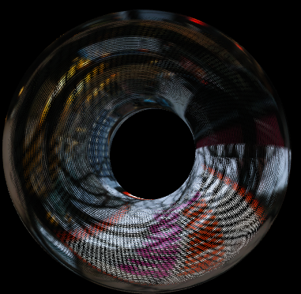
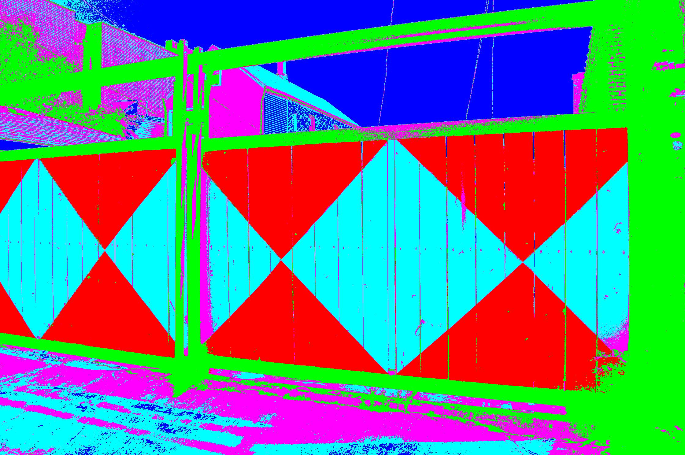
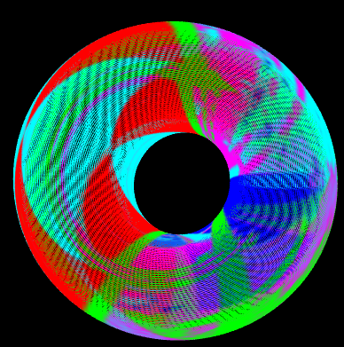
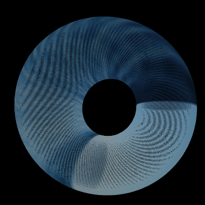

# ImageTorus
OpenFrameworks code to wrap an image around a torus.  
A few examples - original image on left, transformed image on right. You can see others in /examples:  

  

  
## Setup  
Install OpenFrameworks according to the setup guidelines [here](https://openframeworks.cc/download/). Once you have OF and the necessary IDE installed, navigate to the Project Generator within the OF directory and create a new project. Inside your project replace the contents of /src and bin/data with those in this repo. Add any images you'd like to bin/data. In ofApp.cpp, inside the setup() function, change the path in img.load() to the image that you'd like to wrap. 
## Issues
+ Cannot work with large images. Right now I resize images to 200 x 200 in setup()
+ Produces the toroidal image but has to abort shortly after in Visual Studio.
